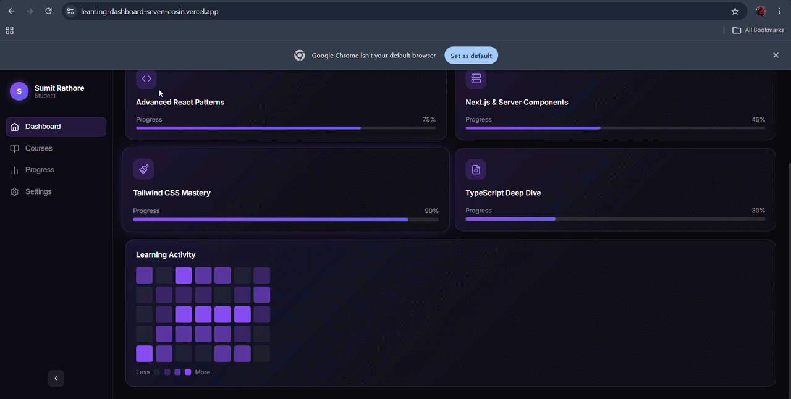

# 🚀 Next-Gen Learning Dashboard

A futuristic student dashboard built with Next.js, Supabase, Tailwind CSS, and Framer Motion.

## 🎥 Demo


## 🌐 Live Demo
👉 [learning-dashboard-seven-eosin.vercel.app](https://learning-dashboard-seven-eosin.vercel.app)

## 🛠️ Tech Stack
- **Framework**: Next.js 15 (App Router)
- **Database**: Supabase (PostgreSQL)
- **Styling**: Tailwind CSS
- **Animations**: Framer Motion
- **Icons**: Lucide React
- **Deployment**: Vercel

## 🏗️ Architectural Choices

### Why Next.js App Router?
I chose the App Router because it enables React Server Components out of the box, allowing me to fetch data directly on the server without exposing API keys to the client. This results in faster page loads and better security.

### Why Supabase?
Supabase provides a simple PostgreSQL database with a clean JavaScript SDK. It allowed me to set up the courses table quickly and fetch data securely from server components without needing a separate backend.

### Why Framer Motion?
Framer Motion's spring physics system creates natural, hardware-accelerated animations that avoid layout shifts. The `layoutId` feature was perfect for the sidebar navigation highlight micro-interaction.

## ⚡ Server/Client Component Split

### Server Components (No 'use client')
- `src/app/page.tsx` — Fetches course data from Supabase on the server
- `src/app/loading.tsx` — Automatic loading UI handled by Next.js

### Client Components ('use client')
- `Sidebar.tsx` — Needs useState for collapse/active state
- `HeroTile.tsx` — Uses Framer Motion animations
- `CourseTile.tsx` — Uses Framer Motion animations
- `ActivityTile.tsx` — Uses Framer Motion animations
- `SkeletonLoader.tsx` — Uses Framer Motion pulse animation

This split ensures maximum performance — data fetching happens on the server while animations run on the client.


### Data Fetching
- Course data is fetched server-side using `@supabase/supabase-js`
- Environment variables are kept secure and never exposed to the client

### Animations
- Framer Motion spring physics for all hover and entrance animations
- Staggered tile entrance using sequential `delay` props
- `layoutId` used for sidebar navigation highlight
- Progress bars animate from 0% to actual value on load

## 🗄️ Database Schema

```sql
create table courses (
  id uuid primary key default gen_random_uuid(),
  title text,
  progress integer,
  icon_name text,
  created_at timestamptz default now()
);
```

## 💡 Challenges Faced

### 1. Hydration Errors with Framer Motion
Using `window.innerWidth` inside `useState` caused server/client mismatch. I solved this by handling responsive behavior through CSS media queries instead of JavaScript.

### 2. Tailwind Opacity Classes Not Rendering
Tailwind's JIT compiler was purging opacity modifier classes like `bg-violet-500/20`. I solved this by switching to inline CSS `rgba()` values for all opacity-based colors.

### 3. Environment Variables in Production
Ensuring Supabase keys were available on Vercel required manually adding them as environment variables in the Vercel dashboard before deployment.

## 🚀 Getting Started

1. Clone the repository:
```bash
   git clone https://github.com/Techvenom18/learning-dashboard.git
   cd learning-dashboard
```

2. Install dependencies:
```bash
   npm install
```

3. Copy `.env.example` to `.env.local`:
```bash
   cp .env.example .env.local
```

4. Add your Supabase credentials to `.env.local`

5. Run the development server:
```bash
   npm run dev
```

## 🔐 Environment Variables

```env
NEXT_PUBLIC_SUPABASE_URL=your_supabase_project_url
NEXT_PUBLIC_SUPABASE_ANON_KEY=your_supabase_anon_key
```

## 📱 Responsive Design
- **Desktop** (>1024px): Full sidebar + Bento grid
- **Tablet** (768px-1024px): Collapsed icon sidebar + 2 column grid
- **Mobile** (<768px): Bottom navigation + single column layout